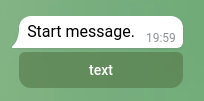
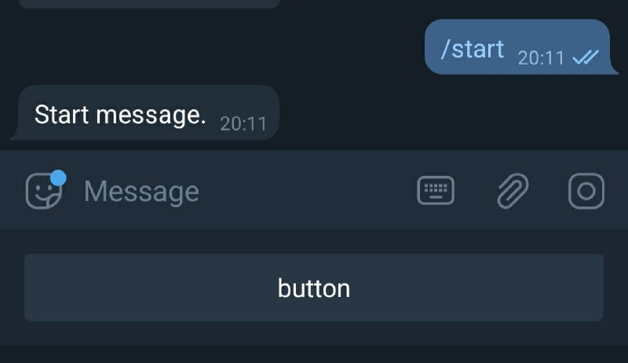

This project is designed to be a convenient way for programming telegram bots.
Build on spring boot starter.

**1. Importing library.**

```xml
    <dependency>
        <groupId>io.github.butkoprojects</groupId>
        <artifactId>spring-boot-telegram-bots</artifactId>
        <version>1.1.0</version>
    </dependency>
```

**2. Creating bot.** 

The only thing you need to do after adding the dependency is to create a bean for a bot. E.g.:

```java
@Component
public class Bot extends TelegramLongPollingBotWrapper {

}
```

**3. Controller**

You can create controller which will process telegram requests.

Example:
```java
@Component
public class Controller {

}
```

_**3.1 Text messages**_

To create message receiver just map your method with annotation.

Example:
```java
@MessageRequest( value = "/start" )
public SendMessage start( final Update update ) {
    return SendMessage.builder()
        .chatId(String.valueOf(update.getMessage().getChatId()))
        .text("Start message.")
        .build();
}
```
Or:
```java
@MessageRequest( value = "/start" )
public String start( final Update update ) {
    return "Start message.";
}
```
_The last example will send message back to request chat._

**3.2 Callback messages**

Firstly you need to create button, and create callback data for it by such pattern:

[_call_back_mapping| some data_]

we need [_call_back_mapping_] for understanding which method should handle this request.

Example:

```java
@MessageRequest( "/start" )
public SendMessage start( final Update update ) {
    InlineKeyboardMarkup replyMarkup = new InlineKeyboardMarkup();
    List<List<InlineKeyboardButton>> keyBoardRows = new ArrayList<>();

    InlineKeyboardButton moreButton = new InlineKeyboardButton();
    moreButton.setText( "text" );
    moreButton.setCallbackData( "more| some data" );
        
    keyBoardRows.add( Arrays.asList( moreButton ) );
    replyMarkup.setKeyboard( keyBoardRows );
        
    return SendMessage.builder()
        .replyMarkup( replyMarkup )
        .chatId(String.valueOf(update.getMessage().getChatId()))
        .text("Start message.")
        .build();
}
```

As a result you will get such callback button:



Now lets see how to process our event:

```java
@CallbackRequest( value = "more", showAlert = false )
public BotApiMethod answerCallback( final Update update ) {
    return AnswerCallbackQuery.builder()
        .text( "Success!" )
        .callbackQueryId( update.getCallbackQuery().getId() )
        .build()
}
```

Or:

```java
@CallbackRequest( value = "more", showAlert = false )
public String answerCallback( final Update update ) {
    return "Success!";
}
```

**3.3 Text buttons**

You can add buttons to your response in a convenient way:

```java
@MessageRequest( value = "/start" )
@KeyBoardButton("button")
public String start( final Update update ) {
    return "Start message.";
}
```

As a result you will get such button:



You can experiment with variations like here:

```java
@MessageRequest( value = "/start" )
@KeyBoardRow({ @KeyBoardButton("button1"), @KeyBoardButton("button1") })
@KeyBoardRow({ @KeyBoardButton("button2"), @KeyBoardButton("button2") })
public String start( final Update update ) {
    return "Start message.";
}
```

_This will add 4 buttons, 2 per row._